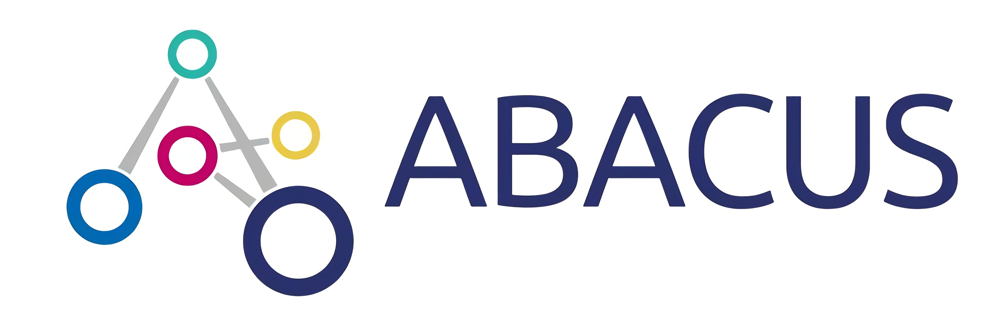

    

    
    

# About ABACUS
ABACUS is an open-source DFT software supporting both plane wave and numerical atomic basis. Apart from single-point calculations, we also allow geometry optimization, ab-initio molecular dynamics and as well as molecular dynamics with classical force fields (CMD). ABACUS supports LDA, GGA and meta-GGA functionals, with hybrid functionals under development. We also provide a variety of functionalities for simulating complex materials, including DFT+U correction, VdW correction and implicit solvation model.

Written in C++, ABACUS strives to provide a general infrastructure to facilitate the application of novel machine learning-assisted DFT methods in molecular and material simulations. We have successfully implemented the DeePKS method, as well as interfaces to DP-GEN and DeepH.

# Online Documentation
For detailed documentation, please refer to this [website](http://abacus.deepmodeling.com/en/latest/).