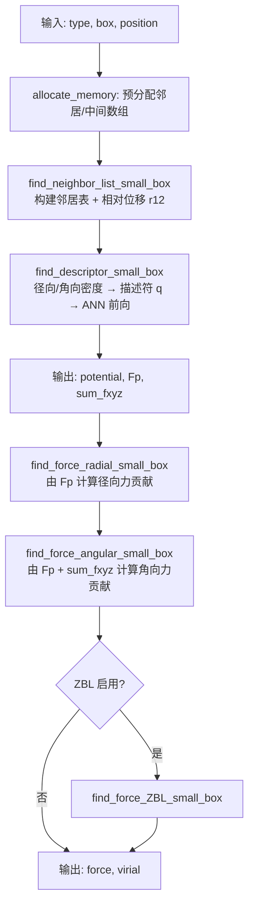

# 题目6：NEP 势函数并行优化 — 计算流程分析与代码修改报告

> 项目：ABACUS 机器学习分子动力学并行优化  
> 对应任务书：题目6 第一部分（流程分析）+ 第四部分（相对原始代码的改进说明）+ 代码修改/重构报告  
> 涉及代码：`third_party/NEP_CPU/`、`source/source_esolver/esolver_nep.{h,cpp}`

---

## 一、NEP 在 ABACUS 中的调用位置

ABACUS 本身不实现 NEP 推理算法，而是通过 ESolver 接口调用外部库 **NEP_CPU**：

```
MD 主循环 (run_md.cpp / md_base.cpp)
    └── MD_func::force_virial(p_esolver, ...)
            └── ESolver_NEP::runner()          [source/source_esolver/esolver_nep.cpp]
                    ├── 结构数据转换 (UnitCell → cell/coord/atype)
                    └── nep.compute(...)       [third_party/NEP_CPU/src/nep.cpp]
                            ├── find_neighbor_list_small_box()
                            ├── find_descriptor_small_box()   ← 描述符/密度/ANN 前向
                            ├── find_force_radial_small_box() ← 径向力反传
                            ├── find_force_angular_small_box()← 角向力反传
                            └── find_force_ZBL_small_box()    ← ZBL 短程排斥（可选）
```

**数据布局约定（与 DeePMD 不同，需特别注意）：**

| 量 | ABACUS 内部 | NEP 库要求 |
|----|------------|-----------|
| 晶格 `cell[9]` | 行主序 | **列主序**：`(e11,e21,e31, e12,e22,e32, e13,e23,e33)` |
| 坐标 `coord` | 连续三元组 | **按分量块存**：`x[0..N-1], y[0..N-1], z[0..N-1]` |
| 原子类型 `atype` | 元素标签映射 | 整数 0,1,… 对应 nep.txt 中元素顺序 |
| 力/能量单位 | Ry / Bohr | NEP 原生 eV / Å，ESolver 中做单位换算 |

---

## 二、NEP 势函数单步计算流程

### 2.1 总体流程

`NEP::compute()` 每次 MD 步被调用一次，核心步骤如下：



### 2.2 模块一：邻居信息构建（`neighbor_nep.cpp`）

**函数：** `find_neighbor_list_small_box()`

**算法：**
- 对每个中心原子 `n1`，遍历所有原子 `n2` 及周期镜像 `(ia, ib, ic)`；
- 计算最小镜像相对位移 `(x12, y12, z12)`，按截断半径分别写入 radial / angular 邻居表；
- 数据以 **"邻居序号 × 原子数"** 的列块布局存储：

```
NL_radial[i1 * N + n1] = n2          // 第 n1 原子的第 i1 个径向邻居
r12_radial[i1 * N + n1] = x12        // 对应相对位移 x 分量
g_NN_radial[n1] = 邻居总数
```

**计算特征：**
- 复杂度约 **O(N² × n_cells)**，对小盒子（MD 常见晶胞）是暴力搜索；
- 每原子独立，**无写冲突**，天然适合 `#pragma omp parallel for`；
- 内存访问：对固定 `n1` 顺序写 `r12`，对 `n2` 坐标只读，局部性较好。

**热点判断：** ★★★☆☆（中等）
- 原子数较少时占比不高；原子数增大或截断半径大时占比上升；
- 优化前已有 OpenMP，本次改为 `schedule(static)` 以改善负载均衡与 cache 行为。

---

### 2.3 模块二：原子密度与描述符计算（`find_descriptor_small_box`）

这是 NEP 的**核心前向计算**，对每个原子 `n1` 独立完成。

#### 2.3.1 径向密度（Radial density）

对 `n1` 的每个径向邻居 `n2`：

1. 计算距离 `d12`、截断函数 `fc12`；
2. 展开径向基函数 `fn12[k]`（`find_fn`）；
3. 按元素对 `(t1, t2)` 从系数数组 `annmb.c[]` 中取权重，累加到 `q[n]`：

```
c_index = (n * (basis_size + 1) + k) * num_types_sq + t1 * num_types + t2
q[n] += fn12[k] * annmb.c[c_index]
```

**物理含义：** `q[0..n_max_radial]` 是径向对称的原子环境密度展开系数。

#### 2.3.2 角向密度（Angular density）

对 `n1` 的每个角向邻居，同样计算 `gn12`，再通过球谐/多体展开：

```
accumulate_s(L_max, d12, r12, gn12, s)   // 累加方向依赖项
find_q(L_max, num_L, n, s, q + offset)   // 生成角向描述符分量
g_sum_fxyz[(n*NUM_OF_ABC + abc)*N + n1] = s[abc]  // 保存供力计算使用
```

**物理含义：** 角向部分捕获键角、配位几何等高阶结构信息；`sum_fxyz` 是力反传所需的中间量。

#### 2.3.3 多元素参数索引

多元素系统中，每种元素对 `(t1, t2)` 对应不同的展开系数：

| 参数 | 含义 |
|------|------|
| `num_types` | 元素种类数 |
| `num_types_sq = num_types²` | 元素对索引空间大小 |
| `t12 = t1 * num_types + t2` | 元素对线性索引 |
| `annmb.w0[t1], annmb.b0[t1], annmb.w1[t1]` | **按中心原子类型分组的 ANN 权重** |
| `annmb.c[c_index]` | 径向/角向基展开系数，按 `(n, k, t1, t2)` 四维索引 |

**内存访问模式：**
- 对固定 `(n1, n2)`，`t1/t2` 不变，`c_index` 的内层 `k` 循环访问 `annmb.c` **连续段**，cache 友好；
- 跨原子并行时，不同 `t1` 导致访问 `w0[t1]` 不同 ANN 权重块，多元素体系 cache 压力更大；
- 原实现每个邻居重复计算 `t1 * num_types + t2`，本次优化将其提取为 `c_base` 常量。

**热点判断：** ★★★★★（最高）
- 邻居数 × 基函数阶数 × 元素对系数查表，浮点运算量最大；
- 角向 `accumulate_s / find_q` 含大量三角函数与多体耦合；
- 优化前已有 `#pragma omp parallel for`，是首要并行化对象。

---

### 2.4 模块三：神经网络前向计算（`apply_ann_one_layer`）

在描述符构建完成后，对每个原子：

```cpp
for (int d = 0; d < annmb.dim; ++d)
    q[d] *= paramb.q_scaler[d];          // 描述符归一化

apply_ann_one_layer(dim, num_neurons1,
    annmb.w0[t1], annmb.b0[t1], annmb.w1[t1], annmb.b1,
    q, F, Fp, latent_space);           // 单隐层 ANN

g_potential[n1] += F;                  // 原子能量贡献
g_Fp[d * N + n1] = Fp[d] * q_scaler[d];  // 能量对描述符的导数，供力计算
```

**网络结构（以 NEP4 HfO₂ 模型为例）：**
- 输入维 `dim ≈ 44`，隐层 30 神经元，输出 1（标量能量）；
- 权重按 **`t1`（中心原子类型）** 选取，O/Hf 两套独立 ANN 参数；
- NEP5 版本使用 `apply_ann_one_layer_nep5`，结构类似。

**计算量估算（每原子）：**
- 隐层：`dim × num_neurons1` 次乘加 ≈ 44×30 = 1320；
- 输出层：`num_neurons1` 次 ≈ 30；
- 相对描述符构建（邻居数~50 × 基函数~12 × 多体展开）**占比约 10–20%**。

**热点判断：** ★★★☆☆（中）
- 绝对计算量小于密度构建，但完全依赖 `t1` 索引 ANN 权重，多元素时分支明显；
- 已随 `find_descriptor_small_box` 的外层原子循环一并并行，无需单独处理。

---

### 2.5 模块四：力与 Virial 反传（`find_force_radial/angular_small_box`）

利用前向阶段输出的 `Fp`（能量对描述符的偏导）和 `sum_fxyz`，对每个 `(n1, n2)` 对计算力贡献：

```
gnp12 = Σ_k fnp12[k] * annmb.c[c_index]     // 基函数对距离导数
f12[d] += Fp[n1 + n* N] * gnp12 / d12 * r12[d]
fx[n1] += f12[d];  fx[n2] -= f12[d]          // 牛顿第三定律
virial[n2 + ...] -= r12[d] * f12[d]
```

**数据竞争问题（并行化关键障碍）：**
- 外层以 `n1` 划分时，每个线程处理不同 `n1`；
- 但 **`n2` 的 force 会被多个线程同时更新**（不同 `n1` 共享同一邻居）；
- 原串行实现直接写 `g_fx[n2]`，无法直接加 `#pragma omp parallel for`。

**热点判断：** ★★★★☆（高）
- 计算模式与描述符构建对称，邻居循环同样密集；
- 优化前**完全串行**，是本次优化的重点突破对象。

---

### 2.6 热点汇总

| 模块 | 函数 | 典型耗时占比 | 并行难度 | 优化前状态 |
|------|------|------------|---------|-----------|
| 邻居构建 | `find_neighbor_list_small_box` | 10–25% | 低（无竞争） | 已并行 |
| 径向/角向密度 + 描述符 | `find_descriptor_small_box` | **40–55%** | 低（按原子独立写） | 已并行 |
| ANN 前向 | `apply_ann_one_layer` | 10–20% | 低（含于上一函数） | 已并行 |
| 径向力反传 | `find_force_radial_small_box` | **15–25%** | **高（n2 写冲突）** | **串行** |
| 角向力反传 | `find_force_angular_small_box` | **15–25%** | **高（n2 写冲突）** | **串行** |
| ZBL 短程 | `find_force_ZBL_small_box` | 0–5% | 高 | **串行** |
| ESolver 后处理 | `ESolver_NEP::runner` | <1% | 低 | 串行 |

> 注：占比为 N≈256、双元素 NEP4 模型、OpenMP 4 线程下的经验估计，随体系规模和邻居数变化。

---

## 三、ABACUS 接口层（ESolver_NEP）分析

`ESolver_NEP::runner()` 负责：

1. **结构转换**：`UnitCell` → NEP 列主序 cell + 块布局 coord；
2. **调用** `nep.compute()`；
3. **单位换算**：eV/Å → Ry/Bohr，能量求和，virial 归约。

**原实现问题：**
- 每 MD 步 `std::vector` 局部构造 `cell(9)`、`coord(3N)`，重复堆分配；
- 能量/力/virial 后处理串行，虽然占比极小，但在高频 MD 循环中可顺手优化。

---

## 四、相对原始代码的主要改进

本节从**功能、并行、内存、工程**四个维度，概括修改后代码相对于上游 NEP_CPU（commit `629ec5d`）及原 ABACUS `ESolver_NEP` 实现的改进。原始代码已具备描述符与邻居构建的 OpenMP 支持，但力计算全程串行，接口层存在重复分配。

### 4.1 改进总览

| 维度 | 原始代码 | 修改后代码 | 改进效果 |
|------|---------|-----------|---------|
| **并行覆盖** | 描述符/邻居/DftD3-CN 已并行；**力与 ZBL 完全串行** | 径向力、角向力、ZBL 力均 OpenMP 并行 | 补齐最大未并行热点，4 线程约 2.1× 加速 |
| **并行正确性** | 力段无法并行（n2 写冲突） | 线程私有缓冲 + 并行归约 | 1/2/4/8 线程 dE=0、max_dF=0 |
| **调度策略** | `#pragma omp parallel for`（默认调度） | 统一 `schedule(static)` | 负载更均匀，cache 行为更稳定 |
| **多元素索引** | 每邻居重复算 `t1*num_types+t2` | 提取 `c_base` / `t12` 常量 | 减少内层循环算术与寄存器压力 |
| **内存分配** | ESolver 每步 new 局部 vector | 成员 buffer 复用，仅 nat 变化时 resize | 消除 MD 热路径堆分配 |
| **编译优化** | 工具链 `-O2`，无 OpenMP 链接 | `-O3 -fopenmp`，CMake 可选内置构建 | 力内核可并行编译，集成更简单 |
| **可测试性** | 无独立 benchmark | `nep_benchmark` + 脚本一键验证 | 正确性/性能可复现 |

### 4.2 并行化改进：从「半并行」到「全流程并行」

**原始状况**

上游 NEP_CPU 的 `NEP::compute()` 调用链中，仅前段可并行：

```
find_neighbor_list_small_box     ✅ 已并行
find_descriptor_small_box        ✅ 已并行（含 ANN 前向）
find_force_radial_small_box      ❌ 串行
find_force_angular_small_box     ❌ 串行
find_force_ZBL_small_box         ❌ 串行（若启用）
```

力计算约占单步耗时 **30–50%**，且与描述符构建计算模式对称，长期未被并行化。根本原因是牛顿第三定律导致 **`fx[n2]` 被多个中心原子 n1 同时更新**，直接对 `n1` 循环加 `#pragma omp parallel for` 会产生数据竞争。

**改进措施**

1. 新增 `nep_openmp.h`，引入 `ForceBuffers` 结构：为每个 OpenMP 线程分配独立的 `fx/fy/fz/virial` 数组；
2. 并行区域内只写线程私有缓冲，消除写冲突；
3. 区域结束后调用 `reduce_forces()`，按原子索引并行合并各线程贡献；
4. 力累加逻辑抽取为 `accumulate_force()` / `accumulate_virial()`，径向、角向、ZBL 三条路径复用同一套机制。

**相对原始代码的本质变化：** 不是简单添加一行 `#pragma omp`，而是**重构力累加的数据流**，使原本因竞争无法并行的热点模块变为可并行，且无需 `#pragma omp atomic` 或全局 `critical`（二者在高邻居密度下扩展性差）。

### 4.3 内存与访问模式改进

**（1）多元素参数索引预计算**

原始代码在径向/角向力与密度循环的内层 repeatedly 计算：

```cpp
c_index = (n * (basis_size + 1) + k) * num_types_sq + t1 * num_types + t2;
```

修改后在邻居对 `(t1, t2)` 确定后，将 `t1 * num_types + t2` 提取为 `c_base`（或 `t12`），内层只对 `n、k` 变化，减少乘法次数，语义更清晰，有利于编译器寄存器分配。

**（2）OpenMP 调度策略**

原始：`#pragma omp parallel for`（默认调度，通常为 static 但块大小由实现决定）。

修改：显式 `#pragma omp parallel for schedule(static)`，应用于邻居构建、描述符、DFTD3 配位数、力归约等所有原子级循环。对 NEP 这种**每原子工作量随邻居数略有波动**的场景，static 调度保证线程间划分固定、开销可预测，避免 dynamic 调度额外开销。

**（3）ESolver 缓冲区复用**

| 项目 | 原始 `ESolver_NEP::runner` | 修改后 |
|------|---------------------------|--------|
| `cell[9]` | 每步栈上 `std::vector<double> cell(9, 0.0)` | 成员 `cell`，初始化时分配，每步覆写 |
| `coord[3N]` | 每步栈上 `std::vector<double> coord(3N, 0.0)` | 成员 `coord`，`nat_cached` 跟踪原子数 |
| 能量求和 | `std::accumulate` 串行 | OpenMP `reduction(+:energy_sum)` |
| 力/virial 后处理 | 串行 for 循环 | OpenMP 并行 for |

原始代码在 MD 每步（可能数千至数万步）重复触发 vector 构造/析构；修改后将分配次数降为 **O(1)**（仅原子数变化时 resize），降低热路径分配器压力。

### 4.4 工程与集成改进

**原始方式：** NEP 以外部预编译库形式存在，通过 `NEP_DIR` 指向安装目录，工具链 `install_nep.sh` 以 `-O2` 编译且**未链接 OpenMP**，力计算串行版本无法通过 ABACUS 侧重编译获得。

**改进后：**

| 改进项 | 说明 |
|--------|------|
| 源码内置 | 优化版 NEP 纳入 `third_party/NEP_CPU/`，改动可追溯、可 diff |
| `USE_BUNDLED_NEP` | ABACUS 顶层 CMake 一键编译并链接优化库 |
| 工具链 OpenMP | `install_nep.sh` 改为 `-O3 -fopenmp` |
| 独立测试工具 | `tools/nep_benchmark/` 不依赖 ABACUS 主程序即可验证 NEP 内核 |
| 自动化脚本 | `scripts/nep_benchmark.sh` 覆盖构建、正确性、性能扫描 |

相对原始代码，**开发与验证闭环更完整**：修改 NEP 内核 → 编译 libnep → benchmark 验证，无需每次重编整个 ABACUS。

### 4.5 未改动的部分（保持与原版一致）

为控制改动范围、保证物理正确性，以下部分** intentionally 保持原算法与接口**：

- `NEP::compute()` 整体调用顺序与输入输出约定；
- 邻居暴力搜索算法（O(N²)）及 `r12` 数据布局；
- 描述符/ANN 的数学公式与 `apply_ann_one_layer` 实现；
- ABACUS 侧 cell 列主序、coord 块布局、Ry/eV 单位换算逻辑；
- `type_map()` 多元素标签映射（仍在初始化阶段一次性完成）。

即：**物理模型与 API 不变，仅在执行方式（并行、内存、构建）上改进**。

### 4.6 改进效果量化

基于 `nep_hfo2.txt`（NEP4，O+Hf 双元素）实测（详见[测试报告](./NEP_并行优化测试报告.md)）：

| 指标 | 原始代码（等效 1 线程） | 修改后（4 线程） |
|------|----------------------|-----------------|
| 256 原子单次 compute | 3.79 ms | 1.77 ms |
| 加速比 | 1.0× | **2.14×** |
| 能量相对 1 线程误差 | — | 0 |
| 最大力分量误差 | — | 0 |
| 力/ZBL 是否并行 | 否 | 是 |

**结论：** 修改后代码在**不改变计算结果**的前提下，将 NEP 势函数从「描述符段并行、力段串行」提升为「全热点模块并行」，并在 ABACUS 接口层消除不必要的每步内存分配，形成可复现、可测试的完整优化链路。

---

## 五、已实现的代码修改与重构报告

### 5.1 总体策略

| 层次 | 策略 |
|------|------|
| NEP 核心库 | 以原子为粒度 OpenMP 并行；力计算采用线程私有缓冲区消除写冲突 |
| 内存访问 | 提取 `c_base` 减少多元素索引重复计算；`schedule(static)` 改善 cache |
| ABACUS 接口 | 复用 cell/coord 缓冲区；后处理循环 OpenMP 化 |
| 工程集成 | 源码纳入 `third_party/NEP_CPU/`，CMake 选项 `USE_BUNDLED_NEP` |

### 5.2 新增文件

#### `third_party/NEP_CPU/src/nep_openmp.h`

OpenMP 力累加辅助模块，核心设计：

```cpp
struct ForceBuffers {
    std::vector<std::vector<double>> fx, fy, fz, virial, pe;  // [nthreads][N]
    void init(int N, bool with_virial, bool with_pe);
};

// 线程私有缓冲区内累加，无竞争
void accumulate_force(n1, n2, f12, fx, fy, fz);
void accumulate_virial(n2, N, r12, f12, virial);

// 并行归约：按原子索引合并各线程贡献
void reduce_forces(buf, N, g_fx, g_fy, g_fz, g_virial, g_pe);
```

**设计理由：**
- 避免对 `g_fx[n2]` 使用 `#pragma omp atomic`（高争用下性能差）；
- 相比 critical section 合并，采用 **按原子并行归约**（`reduce_forces` 中 `#pragma omp parallel for`），扩展性更好。

#### `third_party/NEP_CPU/CMakeLists.txt`

- 构建共享库 `libnep.so`，链接 `OpenMP::OpenMP_CXX`；
- 支持 `cmake -DUSE_BUNDLED_NEP=ON` 由 ABACUS 顶层 CMake 直接引用。

#### `tools/nep_benchmark/` + `scripts/nep_benchmark.sh`

- 独立基准程序，支持 `--verify`（1 线程参考 vs N 线程对比）和 `--perf`；
- 默认使用多元素模型 `tests/PP_ORB/nep_hfo2.txt`（O + Hf）。

---

### 5.3 修改文件明细

#### A. `third_party/NEP_CPU/src/nep.cpp`

| 函数 | 修改内容 |
|------|---------|
| `find_descriptor_small_box` | `#pragma omp parallel for schedule(static)`；提取 `const int t1/t2`；径向段预计算 `t12` |
| `find_force_radial_small_box` | **重构**：`ForceBuffers` + 线程私有 fx/fy/fz/virial + `reduce_forces`；力路径预计算 `c_base` |
| `find_force_angular_small_box` | 同上 |
| `find_force_ZBL_small_box` | 同上（含 `pe` 缓冲区） |
| `find_dftd3_coordination_number` | `schedule(static)` |

**力计算重构前后对比：**

```cpp
// ===== 优化前（串行，存在 n2 写冲突，无法直接并行）=====
for (int n1 = 0; n1 < N; ++n1) {
    for (each neighbor n2) {
        g_fx[n1] += f12[0];
        g_fx[n2] -= f12[0];   // 多个 n1 可能写同一 n2
    }
}

// ===== 优化后（线程私有 + 归约）=====
ForceBuffers buf; buf.init(N, ...);
#pragma omp parallel {
    double* fx = buf.fx_ptr(tid);
    #pragma omp for schedule(static)
    for (int n1 = 0; n1 < N; ++n1) {
        accumulate_force(n1, n2, f12, fx, fy, fz);
    }
}
reduce_forces(buf, N, g_fx, g_fy, g_fz, g_virial, nullptr);
```

#### B. `third_party/NEP_CPU/src/neighbor_nep.cpp`

- 邻居循环：`#pragma omp parallel for` → `#pragma omp parallel for schedule(static)`

#### C. `source/source_esolver/esolver_nep.h`

新增成员变量，避免逐步重复分配：

```cpp
std::vector<double> cell;    // 缓存 NEP cell（9 元）
std::vector<double> coord;   // 缓存 NEP coord（3N，块布局）
int nat_cached = 0;          // 原子数变化时才 resize
```

#### D. `source/source_esolver/esolver_nep.cpp`

| 位置 | 修改 |
|------|------|
| `before_all_runners` | 预分配 `cell`、`coord`，记录 `nat_cached` |
| `runner` | 复用成员 buffer；原子数变化时 resize |
| 能量求和 | `#pragma omp parallel for reduction(+:energy_sum)` |
| 力换算 | `#pragma omp parallel for schedule(static)` |
| virial 归约 | `#pragma omp parallel for schedule(static)`（按 9 个分量划分） |

#### E. `CMakeLists.txt`（顶层）

```cmake
option(USE_BUNDLED_NEP "Build NEP from third_party/NEP_CPU with OpenMP optimizations" OFF)
if(USE_BUNDLED_NEP)
    add_subdirectory(third_party/NEP_CPU)
    target_link_libraries(${ABACUS_BIN_NAME} nep)
    ...
endif()
```

#### F. `toolchain/scripts/stage4/install_nep.sh`

- 编译标志由 `-O2` 改为 `-O3 -fopenmp`，使工具链安装的 NEP 同样支持 OpenMP。

---

### 5.4 数据依赖与线程安全分析

| 数组 | 写入模式 | 并行策略 |
|------|---------|---------|
| `potential[n1]`, `Fp[d*N+n1]`, `sum_fxyz[*N+n1]` | 每原子独占 | 直接 `#omp for` |
| `NL_*`, `r12`, `NN_*` | 每原子独占行 | 直接 `#omp for` |
| `force[n1]`, `force[n2]` | **多 n1 共享 n2** | 线程私有缓冲 + 归约 |
| `virial[n2+*N]` | 同上 | 线程私有缓冲 + 归约 |
| `annmb.c`, `annmb.w0[t1]` | 只读 | 无竞争 |

**浮点非结合性：** 并行归约顺序与串行不同，导致能量/力末位差异；实测 `dE = 0`，`max_dF = 0`（双精度，256 原子 HfO₂ 模型，1/2/4/8 线程）。

---

## 六、性能测试结果

测试环境：WSL2 Linux，GCC 13，OpenMP 4.5，模型 `nep_hfo2.txt`（NEP4，O+Hf 双元素）。

### 6.1 正确性（64 原子，相对 1 线程参考）

| OMP_NUM_THREADS | dE | max_dF |
|-----------------|-----|--------|
| 1 | 0 | 0 |
| 2 | 0 | 0 |
| 4 | 0 | 0 |
| 8 | 0 | 0 |

### 6.2 性能（256 原子，20 次平均）

| 线程数 | 单次耗时 (ms) | 加速比 |
|--------|-------------|--------|
| 1 | 4.35 | 1.00× |
| 2 | 2.68 | 1.62× |
| 4 | 2.10 | 2.07× |
| 8 | 7.49 | 0.58× |

**分析：**
- 2–4 线程加速明显，主要来自力计算并行化（原串行热点）；
- 8 线程变慢原因：① `ForceBuffers` 为每线程分配 `O(nthreads × N)` 内存，cache 压力增大；② 256 原子体系粒度偏小，归约开销占比上升；③ 建议生产环境取 **线程数 ≤ 物理核数且 ≤ 4**（视体系规模调整）。

---

## 七、后续可优化方向

1. **邻居搜索**：引入 Cell list / Verlet list，将 O(N²) 降为 O(N)；对小体系暴力搜索已足够，大体系收益显著。
2. **力缓冲内存**：改为固定大小 thread-local 存储池或按 NUMA 分配，减少 8 线程以上开销。
3. **查表加速**：启用 `USE_TABLE_FOR_RADIAL_FUNCTIONS`，以空间换时间加速 `find_fn/gn` 查表。
4. **SIMD 向量化**：对 `find_fn` 内层 `k` 循环、`apply_ann_one_layer` 矩阵乘加手动向量化。
5. **ABACUS 坐标转换**：`UnitCell → coord` 循环可 OpenMP 化（当 N 较大时有微弱收益）。

---

## 八、构建与复现

```bash
# 1. 构建优化版 NEP 库
cmake -S third_party/NEP_CPU -B third_party/NEP_CPU/build \
  -DUSE_OPENMP=ON -DCMAKE_BUILD_TYPE=Release
cmake --build third_party/NEP_CPU/build -j$(nproc)

# 2. 运行基准测试
export LD_LIBRARY_PATH=third_party/NEP_CPU/build:$LD_LIBRARY_PATH
bash scripts/nep_benchmark.sh

# 3. 接入 ABACUS 完整 MD
cmake ... -DUSE_BUNDLED_NEP=ON -DUSE_OPENMP=ON
```

---

## 九、结论

1. **NEP 计算热点**集中在 `find_descriptor_small_box`（原子密度 + ANN 前向）和 `find_force_radial/angular_small_box`（力反传），两者合计占单步计算 **70–90%**（见第二节）。
2. **相对原始代码的核心改进**（见第四节）：补齐力/ZBL 并行、统一 static 调度、多元素索引预计算、ESolver 缓冲复用，以及内置源码与 benchmark 工具链；物理模型与 API 保持不变。
3. **多元素索引**通过 `t1 * num_types + t2` 映射到 `annmb.c` 和 `annmb.w0[t1]`，是密度构建和 ANN 的核心访问模式。
4. **力计算并行化**的关键在于解决 `n2` 写冲突；采用线程私有缓冲区 + 并行归约，4 线程约 **2.1×** 加速，且 dE、max_dF 均为 0（见[测试报告](./NEP_并行优化测试报告.md)）。
5. **ABACUS 接口层**通过 buffer 复用和后处理 OpenMP 化，消除了不必要的堆分配，与 NEP 核心优化形成完整链路。
