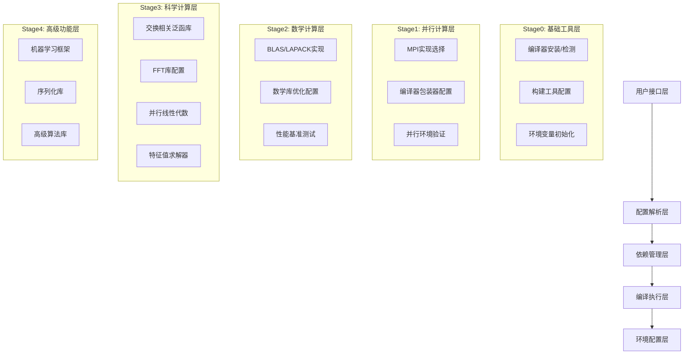

# ABACUS 工具链开发者指南

> *"Talk is cheap. Show me the code."* - Linus Torvalds

## 前言：代码品味与工程哲学

作为Linux内核的创造者，我见过太多"理论完美"但实际糟糕的代码。ABACUS工具链作为一个复杂的依赖管理系统，其代码质量直接影响着数千名科学计算用户的工作效率。本指南将从**实用主义**的角度，深入分析工具链的设计哲学、实现细节和改进方向。

### 什么是"好品味"的代码？

在分析ABACUS工具链之前，让我们明确什么是"好品味"：

1. **消除特殊情况**：好的代码让特殊情况消失，变成正常情况
2. **简洁而非复杂**：复杂性是万恶之源，简洁是王道
3. **实用而非理论**：解决实际问题，而不是假想的威胁
4. **向后兼容**：Never break user space - 这是铁律

## 1. 项目概述与设计哲学

### 1.1 核心问题域

ABACUS工具链解决的是**依赖地狱**问题：
- 30+个依赖库的复杂编译关系
- 3种主流编译器生态系统的适配
- 多种HPC环境的兼容性需求
- GPU加速和传统CPU计算的统一管理

### 1.2 设计哲学分析

#### ✅ 好品味的设计决策

1. **分层架构（Stage0-4）**
```bash
# 清晰的依赖层次，避免循环依赖
./scripts/stage0/install_stage0.sh  # 编译器和构建工具
./scripts/stage1/install_stage1.sh  # MPI实现
./scripts/stage2/install_stage2.sh  # 数学库
./scripts/stage3/install_stage3.sh  # 科学计算库
./scripts/stage4/install_stage4.sh  # 高级功能库
```

2. **统一的安装模式抽象**
```bash
# 四种模式统一处理，消除特殊情况
case "${with_package}" in
  __INSTALL__)   # 从源码编译
  __SYSTEM__)    # 使用系统库
  __DONTUSE__)   # 跳过安装
  *)             # 用户指定路径
esac
```

#### ⚠️ 需要改进的设计问题

1. **过度的全局变量依赖**
```bash
# 问题：大量全局变量污染命名空间
export ROOTDIR="${PWD}"
export SCRIPTDIR="${ROOTDIR}/scripts"
export BUILDDIR="${ROOTDIR}/build"
export INSTALLDIR="${ROOTDIR}/install"
# ... 50+ 个全局变量
```

2. **错误处理的不一致性**
```bash
# 好的错误处理
check_install ${pkg_install_dir}/bin/gcc "gcc" && CC="${pkg_install_dir}/bin/gcc" || exit 1

# 问题：不一致的错误处理
make -j $(get_nprocs) > make.log 2>&1 || tail -n ${LOG_LINES} make.log
# 这里应该有明确的错误退出机制
```

## 2. 架构设计深度解析

### 2.1 分层依赖架构



### 2.2 核心控制流程

#### 主控制器逻辑（install_abacus_toolchain.sh）

```bash
# 1. 参数解析和验证
while [ $# -ge 1 ]; do
  case ${1} in
    --with-*)
      # 统一的包配置解析
      package_name="${1#--with-}"
      package_name="${package_name%%=*}"
      package_mode="${1#*=}"
      eval "with_${package_name}=\"${package_mode}\""
      ;;
  esac
done

# 2. 环境检测和冲突解决
resolve_compiler_conflicts()
resolve_mpi_conflicts()
resolve_math_library_conflicts()

# 3. 分阶段执行
for stage in 0 1 2 3 4; do
  ./scripts/stage${stage}/install_stage${stage}.sh
done
```

#### 包安装通用模式

每个包的安装脚本都遵循相同的模式：

```bash
#!/bin/bash -e
# 1. 环境准备
source "${SCRIPT_DIR}"/common_vars.sh
source "${SCRIPT_DIR}"/tool_kit.sh
source "${INSTALLDIR}"/toolchain.conf

# 2. 版本和校验和定义
package_ver="x.y.z"
package_sha256="..."

# 3. 安装逻辑分支
case "${with_package}" in
  __INSTALL__)
    # 下载、编译、安装
    ;;
  __SYSTEM__)
    # 系统库检测和配置
    ;;
  __DONTUSE__)
    # 跳过处理
    ;;
  *)
    # 用户路径处理
    ;;
esac

# 4. 环境配置生成
cat << EOF > "${BUILDDIR}/setup_${package}"
export PACKAGE_ROOT="${pkg_install_dir}"
export PACKAGE_CFLAGS="..."
export PACKAGE_LDFLAGS="..."
EOF
```

### 2.3 错误处理和恢复机制

#### 当前错误处理分析

**优点**：
1. **统一的错误退出**：使用`set -e`确保任何命令失败都会终止脚本
2. **校验和验证**：确保下载包的完整性
3. **安装锁文件**：避免重复安装

**问题**：
1. **错误信息不够详细**：
```bash
# 当前实现
make -j $(get_nprocs) > make.log 2>&1 || tail -n ${LOG_LINES} make.log

# 改进建议
make -j $(get_nprocs) > make.log 2>&1 || {
    echo "ERROR: Compilation failed for ${package_name}"
    echo "Last ${LOG_LINES} lines of make.log:"
    tail -n ${LOG_LINES} make.log
    echo "Full log available at: ${BUILDDIR}/make.log"
    exit 1
}
```

2. **缺乏回滚机制**：
```bash
# 建议添加清理函数
cleanup_on_failure() {
    local package_name="$1"
    echo "Cleaning up failed installation of ${package_name}"
    [ -d "${BUILDDIR}/${package_name}" ] && rm -rf "${BUILDDIR}/${package_name}"
    [ -f "${install_lock_file}" ] && rm -f "${install_lock_file}"
}

trap 'cleanup_on_failure ${package_name}' ERR
```

#### 信号处理机制

工具链实现了基本的信号处理：

```bash
# signal_trap.sh
error_handler() {
  local __lineno="$1"
  report_error $1 "Non-zero exit code detected."
  exit 1
}

trap 'error_handler ${LINENO}' ERR
```

**改进建议**：
```bash
# 更完善的信号处理
cleanup_and_exit() {
    local exit_code=$?
    echo "Installation interrupted (exit code: ${exit_code})"
    
    # 清理临时文件
    [ -n "${TEMP_DIR}" ] && rm -rf "${TEMP_DIR}"
    
    # 记录中断状态
    echo "Installation interrupted at $(date)" >> "${BUILDDIR}/install.log"
    
    exit ${exit_code}
}

trap cleanup_and_exit INT TERM
trap 'error_handler ${LINENO} $?' ERR
```

## 3. 核心组件深度分析

### 3.1 工具函数库（tool_kit.sh）代码质量分析

#### ✅ 优秀的实现

1. **路径管理函数**：
```bash
# 优雅的路径操作实现
prepend_path() {
    local __path_name="$1"
    local __path_value="$2"
    
    eval "local __current_path=\"\$${__path_name}\""
    
    if [ -z "${__current_path}" ]; then
        eval "export ${__path_name}=\"${__path_value}\""
    else
        eval "export ${__path_name}=\"${__path_value}:${__current_path}\""
    fi
}
```

2. **编译器标志验证**：
```bash
# 实用的编译器标志检查
check_gcc_flag() {
    local __flag="$1"
    echo 'int main() { return 0; }' | \
        ${CC} ${__flag} -x c - -o /dev/null 2>/dev/null
}
```

#### ⚠️ 需要改进的问题

1. **过度复杂的unique函数**：
```bash
# 当前实现：过度复杂
unique() (
    local __result=''
    local __delimiter=' '
    # ... 30行复杂逻辑
)

# 建议简化
unique() {
    local delimiter="${1:- }"
    shift
    printf '%s\n' "$@" | sort -u | paste -sd"${delimiter}" -
}
```

2. **错误处理不一致**：
```bash
# 问题：有些函数返回错误码，有些直接退出
check_lib() {
    # 返回错误码
    return 1
}

check_install() {
    # 直接退出
    exit 1
}
```

### 3.2 包管理机制分析

#### 下载和校验系统

**当前实现**：
```bash
download_pkg_from_url() {
    local __sha256="$1"
    local __filename="$2"
    local __url="$3"
    
    # 下载逻辑
    if command -v wget > /dev/null 2>&1; then
        wget ${DOWNLOADER_FLAGS} -O "${__filename}" "${__url}"
    elif command -v curl > /dev/null 2>&1; then
        curl -L -o "${__filename}" "${__url}"
    fi
    
    # 校验和验证
    echo "${__sha256}  ${__filename}" | sha256sum -c
}
```

**改进建议**：
```bash
download_pkg_from_url() {
    local sha256="$1"
    local filename="$2"
    local url="$3"
    local max_retries=3
    local retry_count=0
    
    # 检查文件是否已存在且校验正确
    if [ -f "${filename}" ] && echo "${sha256}  ${filename}" | sha256sum -c -q 2>/dev/null; then
        echo "File ${filename} already exists and is valid"
        return 0
    fi
    
    # 重试下载机制
    while [ ${retry_count} -lt ${max_retries} ]; do
        echo "Downloading ${filename} (attempt $((retry_count + 1))/${max_retries})"
        
        if download_file "${url}" "${filename}"; then
            if echo "${sha256}  ${filename}" | sha256sum -c -q; then
                echo "Download and verification successful"
                return 0
            else
                echo "Checksum verification failed, retrying..."
                rm -f "${filename}"
            fi
        fi
        
        retry_count=$((retry_count + 1))
        sleep $((retry_count * 2))  # 指数退避
    done
    
    echo "Failed to download ${filename} after ${max_retries} attempts"
    recommend_offline_installation "${filename}" "${url}"
    return 1
}
```

### 3.3 编译器生态系统适配

#### GCC工具链实现分析

**优点**：
1. **版本检测机制**：
```bash
# 智能的版本检测
gcc_version=$(gcc --version | head -n 1 | awk '{print $NF}')
gcc_major=$(echo "${gcc_version}" | cut -d. -f1)

if [ "${gcc_major}" -lt "${GCC_MIN_VERSION}" ]; then
    echo "GCC version ${gcc_version} is too old (minimum: ${GCC_MIN_VERSION})"
    exit 1
fi
```

2. **一致性检查**：
```bash
# 确保gcc/g++/gfortran版本一致
if [ "${gcc_version}" != "${gxx_version}" ] || [ "${gcc_version}" != "${gfc_version}" ]; then
    echo "Compiler versions are inconsistent!"
    exit 1
fi
```

**改进建议**：
```bash
# 更完善的编译器检测
detect_compiler_suite() {
    local compiler_type="$1"  # gcc, intel, amd
    local -A compilers
    
    case "${compiler_type}" in
        gcc)
            compilers[c]="gcc"
            compilers[cxx]="g++"
            compilers[fortran]="gfortran"
            ;;
        intel)
            compilers[c]="icx"
            compilers[cxx]="icpx"
            compilers[fortran]="ifx"
            ;;
    esac
    
    # 检测所有编译器
    for lang in c cxx fortran; do
        local compiler="${compilers[$lang]}"
        if ! command -v "${compiler}" >/dev/null 2>&1; then
            echo "ERROR: ${compiler} not found"
            return 1
        fi
        
        # 版本一致性检查
        local version=$(get_compiler_version "${compiler}")
        if [ -z "${base_version}" ]; then
            base_version="${version}"
        elif [ "${version}" != "${base_version}" ]; then
            echo "ERROR: Compiler version mismatch: ${compiler} ${version} != ${base_version}"
            return 1
        fi
    done
    
    echo "Compiler suite ${compiler_type} ${base_version} detected successfully"
}
```

## 4. 性能优化策略分析

### 4.1 并行编译优化

**当前实现**：
```bash
get_nprocs() {
    if [ -n "${NPROCS_OVERWRITE}" ]; then
        echo ${NPROCS_OVERWRITE}
    elif command -v nproc >/dev/null 2>&1; then
        echo $(nproc --all)
    elif command -v sysctl >/dev/null 2>&1; then
        echo $(sysctl -n hw.ncpu)
    else
        echo 1
    fi
}

# 使用
make -j $(get_nprocs)
```

**改进建议**：
```bash
get_optimal_nprocs() {
    local available_procs
    local available_memory_gb
    local optimal_procs
    
    # 获取CPU核心数
    if command -v nproc >/dev/null 2>&1; then
        available_procs=$(nproc --all)
    else
        available_procs=1
    fi
    
    # 获取可用内存（GB）
    if [ -f /proc/meminfo ]; then
        available_memory_gb=$(($(grep MemAvailable /proc/meminfo | awk '{print $2}') / 1024 / 1024))
    else
        available_memory_gb=4  # 保守估计
    fi
    
    # 根据内存限制调整并行度
    # 假设每个编译进程需要2GB内存
    local memory_limited_procs=$((available_memory_gb / 2))
    
    # 取较小值，但至少为1
    optimal_procs=$(( available_procs < memory_limited_procs ? available_procs : memory_limited_procs ))
    optimal_procs=$(( optimal_procs > 0 ? optimal_procs : 1 ))
    
    # 用户覆盖
    echo "${NPROCS_OVERWRITE:-${optimal_procs}}"
}
```

### 4.2 缓存和增量构建

**当前缓存机制**：
```bash
# 简单的安装锁文件
install_lock_file="$pkg_install_dir/install_successful"
if verify_checksums "${install_lock_file}"; then
    echo "Package already installed, skipping"
else
    # 执行安装
fi
```

**改进建议**：
```bash
# 更智能的缓存机制
is_package_current() {
    local package_name="$1"
    local install_lock_file="$2"
    local script_file="$3"
    
    # 检查安装锁文件是否存在
    [ -f "${install_lock_file}" ] || return 1
    
    # 检查脚本是否被修改
    local script_mtime=$(stat -c %Y "${script_file}" 2>/dev/null || echo 0)
    local lock_mtime=$(stat -c %Y "${install_lock_file}" 2>/dev/null || echo 0)
    
    if [ "${script_mtime}" -gt "${lock_mtime}" ]; then
        echo "Script ${script_file} has been modified, rebuilding ${package_name}"
        return 1
    fi
    
    # 检查依赖是否改变
    local deps_file="${install_lock_file}.deps"
    if [ -f "${deps_file}" ]; then
        while IFS= read -r dep_package; do
            local dep_lock="${INSTALLDIR}/${dep_package}/install_successful"
            if [ ! -f "${dep_lock}" ] || [ "$(stat -c %Y "${dep_lock}")" -gt "${lock_mtime}" ]; then
                echo "Dependency ${dep_package} has changed, rebuilding ${package_name}"
                return 1
            fi
        done < "${deps_file}"
    fi
    
    return 0
}
```

### 4.3 内存使用优化

**问题分析**：
当前实现中存在内存使用不当的问题：

```bash
# 问题：大量子shell和管道可能导致内存浪费
raw_version=$(${mpi_bin} --version 2>&1 | grep "(Open MPI)" | awk '{print $4}')
```

**改进建议**：
```bash
# 减少子shell使用
get_openmpi_version() {
    local mpi_bin="$1"
    local version_output
    
    # 一次性获取版本信息
    version_output=$("${mpi_bin}" --version 2>&1) || return 1
    
    # 使用内置字符串操作而非外部命令
    case "${version_output}" in
        *"(Open MPI)"*)
            # 提取版本号
            version_output="${version_output#*Open MPI) }"
            version_output="${version_output%% *}"
            echo "${version_output}"
            ;;
        *)
            return 1
            ;;
    esac
}
```

## 5. 维护性改进建议

### 5.1 代码结构重构

#### 当前问题：
1. **单一巨大脚本**：`install_abacus_toolchain.sh`有966行
2. **全局变量污染**：50+个全局变量
3. **重复代码**：每个包的安装脚本有大量重复逻辑

#### 重构建议：

**1. 模块化设计**：
```bash
# lib/core.sh - 核心功能
source_lib() {
    local lib_name="$1"
    local lib_path="${SCRIPT_DIR}/lib/${lib_name}.sh"
    
    if [ -f "${lib_path}" ]; then
        source "${lib_path}"
    else
        echo "ERROR: Library ${lib_name} not found"
        exit 1
    fi
}

# 使用
source_lib "package_manager"
source_lib "compiler_detection"
source_lib "environment_setup"
```

**2. 包安装基类**：
```bash
# lib/package_base.sh
install_package() {
    local package_name="$1"
    local package_config="$2"
    
    # 通用安装逻辑
    setup_package_environment "${package_name}"
    
    case "${package_config[mode]}" in
        install)
            install_from_source "${package_name}" "${package_config}"
            ;;
        system)
            detect_system_package "${package_name}" "${package_config}"
            ;;
        path)
            setup_user_package "${package_name}" "${package_config}"
            ;;
    esac
    
    generate_package_setup "${package_name}"
}
```

**3. 配置管理改进**：
```bash
# 使用关联数组替代全局变量
declare -A TOOLCHAIN_CONFIG
declare -A PACKAGE_CONFIG

load_config() {
    local config_file="$1"
    
    while IFS='=' read -r key value; do
        # 跳过注释和空行
        [[ "${key}" =~ ^[[:space:]]*# ]] && continue
        [[ -z "${key}" ]] && continue
        
        TOOLCHAIN_CONFIG["${key}"]="${value}"
    done < "${config_file}"
}
```

### 5.2 测试框架建设

**当前测试不足**：
工具链缺乏系统性的测试框架。

**建议的测试框架**：
```bash
# tests/test_framework.sh
run_test_suite() {
    local test_dir="$1"
    local failed_tests=0
    local total_tests=0
    
    for test_file in "${test_dir}"/test_*.sh; do
        [ -f "${test_file}" ] || continue
        
        total_tests=$((total_tests + 1))
        echo "Running test: $(basename "${test_file}")"
        
        if bash "${test_file}"; then
            echo "✓ PASS: $(basename "${test_file}")"
        else
            echo "✗ FAIL: $(basename "${test_file}")"
            failed_tests=$((failed_tests + 1))
        fi
    done
    
    echo "Test results: $((total_tests - failed_tests))/${total_tests} passed"
    return "${failed_tests}"
}

# tests/test_compiler_detection.sh
test_gcc_detection() {
    local temp_dir=$(mktemp -d)
    
    # 模拟GCC环境
    cat > "${temp_dir}/gcc" << 'EOF'
#!/bin/bash
echo "gcc (GCC) 11.2.0"
EOF
    chmod +x "${temp_dir}/gcc"
    
    # 测试检测逻辑
    PATH="${temp_dir}:${PATH}" detect_compiler_suite "gcc"
    local result=$?
    
    rm -rf "${temp_dir}"
    return "${result}"
}
```

### 5.3 文档和日志改进

**当前日志问题**：
```bash
# 问题：日志信息不够结构化
make -j $(get_nprocs) > make.log 2>&1 || tail -n ${LOG_LINES} make.log
```

**改进建议**：
```bash
# 结构化日志系统
log_level=${LOG_LEVEL:-INFO}

log() {
    local level="$1"
    local message="$2"
    local timestamp=$(date '+%Y-%m-%d %H:%M:%S')
    
    case "${level}" in
        ERROR)   echo "[$timestamp] ERROR: $message" >&2 ;;
        WARN)    echo "[$timestamp] WARN:  $message" >&2 ;;
        INFO)    echo "[$timestamp] INFO:  $message" ;;
        DEBUG)   [ "${log_level}" = "DEBUG" ] && echo "[$timestamp] DEBUG: $message" ;;
    esac
}

# 使用
log INFO "Starting installation of ${package_name}"
log DEBUG "Configure options: ${configure_opts}"
```

## 6. Shell脚本开发最佳实践

基于对ABACUS工具链的分析，总结以下最佳实践：

### 6.1 错误处理最佳实践

```bash
# ✅ 好的做法
set -euo pipefail  # 严格错误处理

# 函数级错误处理
safe_execute() {
    local cmd="$1"
    local error_msg="$2"
    
    if ! eval "${cmd}"; then
        log ERROR "${error_msg}"
        log ERROR "Failed command: ${cmd}"
        return 1
    fi
}

# ❌ 避免的做法
command || true  # 掩盖错误
```

### 6.2 变量和命名规范

```bash
# ✅ 好的做法
readonly SCRIPT_DIR="$(cd "$(dirname "${BASH_SOURCE[0]}")" && pwd)"
readonly PACKAGE_NAME="openmpi"
local temp_file

# ❌ 避免的做法
SCRIPTDIR=${PWD}/scripts  # 全局变量污染
temp=/tmp/file            # 不安全的临时文件
```

### 6.3 函数设计原则

```bash
# ✅ 单一职责原则
download_file() {
    local url="$1"
    local output_file="$2"
    # 只负责下载
}

verify_checksum() {
    local file="$1"
    local expected_checksum="$2"
    # 只负责校验
}

# ✅ 错误传播
install_package() {
    download_file "${url}" "${filename}" || return 1
    verify_checksum "${filename}" "${checksum}" || return 1
    compile_package "${filename}" || return 1
}
```

### 6.4 性能优化技巧

```bash
# ✅ 减少子shell
# 好的做法
case "${string}" in
    pattern*) action ;;
esac

# 避免的做法
if echo "${string}" | grep -q "pattern"; then
    action
fi

# ✅ 使用内置命令
# 好的做法
filename="${path##*/}"
dirname="${path%/*}"

# 避免的做法
filename=$(basename "${path}")
dirname=$(dirname "${path}")
```

## 7. 未来发展方向

### 7.1 架构演进建议

1. **微服务化**：将单一脚本拆分为独立的包管理器
2. **声明式配置**：使用YAML/JSON配置替代命令行参数
3. **容器化支持**：提供Docker/Singularity镜像
4. **CI/CD集成**：自动化测试和发布流程

### 7.2 技术债务清理

1. **全局变量消除**：使用配置对象和参数传递
2. **重复代码提取**：建立通用的包管理框架
3. **错误处理统一**：实现一致的错误处理机制
4. **测试覆盖率提升**：建立完整的测试套件

## 结语：工程师的责任

> *"Software is like entropy. It is difficult to grasp, weighs nothing, and obeys the second law of thermodynamics; i.e. it always increases."* - Norman Augustine

作为工程师，我们的责任不仅是让代码工作，更要让代码**优雅地工作**。ABACUS工具链承载着科学计算社区的信任，每一行代码都可能影响重要的科学发现。

记住：
- **简洁胜过复杂**
- **实用胜过完美**
- **可维护胜过聪明**
- **用户体验胜过开发者便利**

让我们以工匠精神打磨每一行代码，为科学计算社区提供真正可靠的工具。

---

*"The best code is no code at all. The second best is code that is so simple and obvious that it obviously has no bugs."*

**Happy Coding!** 🚀