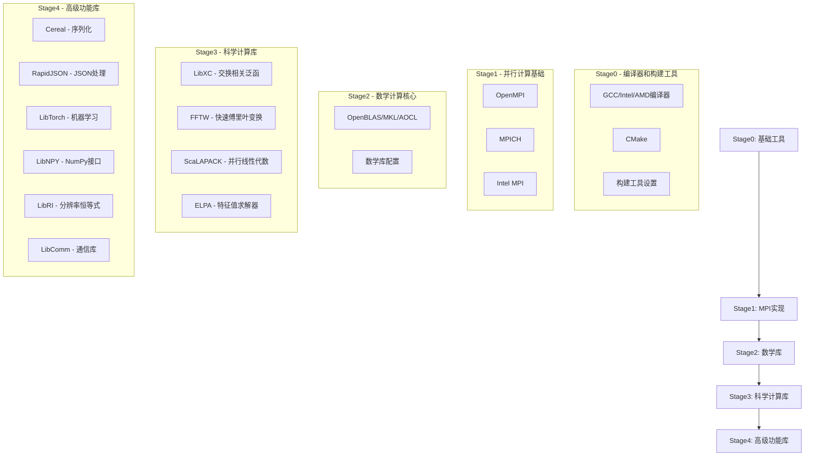

# ABACUS 工具链开发者指南

## 1. 项目概述

ABACUS工具链是一个高度自动化的依赖管理和编译系统，专门为大型科学计算软件ABACUS设计。该工具链解决了在不同HPC环境中编译复杂依赖关系的挑战，支持多种编译器生态系统（GNU、Intel、AMD），并提供智能的环境适配机制。

### 1.1 核心设计理念

- **分层架构**：采用Stage0-4的分层安装策略，确保依赖关系的正确解析
- **环境适配**：支持在线/离线安装、GPU加速、多平台兼容
- **智能检测**：自动检测系统环境和已安装的库，避免重复编译
- **模块化设计**：每个依赖库都有独立的安装脚本，便于维护和扩展

## 2. 整体架构设计

### 2.1 分层安装架构（Stage0-4）



### 2.2 编译器生态系统支持

工具链支持三大编译器生态系统：

#### GNU工具链
- **编译器**：gcc, g++, gfortran
- **特点**：开源免费，广泛支持
- **优化**：支持多种CPU架构优化标志
- **配置**：通过`toolchain_gnu.sh`配置

#### Intel工具链
- **编译器**：icx/icc, icpx/icpc, ifx/ifort
- **MPI**：Intel MPI (mpiicx, mpiicpx, mpiifx)
- **数学库**：Intel MKL
- **特点**：高性能优化，特别适合Intel处理器
- **配置**：通过`toolchain_intel.sh`配置

#### AMD工具链
- **编译器**：AOCC (clang-based)
- **数学库**：AOCL (AMD Optimizing CPU Libraries)
- **特点**：针对AMD处理器优化
- **配置**：通过`toolchain_amd.sh`配置

### 2.3 环境适配机制

#### 在线/离线安装支持
```bash
# 在线安装（默认）
./install_abacus_toolchain.sh --with-openmpi=install

# 离线安装支持
# 1. 预下载包到build目录
# 2. 工具链自动检测并使用本地包
# 3. 支持校验和验证确保包完整性
```

#### GPU加速支持
- **CUDA支持**：通过`--enable-cuda`启用
- **HIP支持**：通过`--enable-hip`启用AMD GPU
- **自动检测**：检测NVCC和相关GPU库
- **编译标志**：自动配置GPU相关的编译和链接标志

#### 多平台兼容
- **x86_64**：Intel/AMD 64位处理器
- **arm64**：Apple Silicon和ARM服务器
- **架构检测**：自动检测并配置相应的优化标志

## 3. 核心脚本详细解析

### 3.1 主控制器脚本（install_abacus_toolchain.sh）

这是工具链的核心控制脚本，负责整个安装流程的协调。

#### 主要功能模块：

1. **参数解析和验证**
```bash
# 支持的主要参数类型
--with-PACKAGE=MODE    # 包安装模式
--enable-FEATURE       # 功能开关
--target-cpu=CPU       # 目标CPU架构
--mpi-mode=MODE        # MPI实现选择
--math-mode=MODE       # 数学库选择
```

2. **环境检测和配置**
```bash
# 编译器检测
check_command gcc g++ gfortran
# 系统环境检测
detect_cray_environment
# GPU环境检测
detect_cuda_hip_support
```

3. **依赖关系管理**
```bash
# 包列表定义
package_list="gcc cmake openmpi mathlibs libxc fftw scalapack elpa cereal rapidjson libtorch libnpy libri libcomm"
# 工具列表定义
tool_list="gcc intel amd"
```

4. **配置文件生成**
```bash
# 生成toolchain.conf配置文件
echo "tool_list=\"${tool_list}\"" > ${INSTALLDIR}/toolchain.conf
for ii in ${package_list}; do
  install_mode="$(eval echo \${with_${ii}})"
  echo "with_${ii}=\"${install_mode}\"" >> ${INSTALLDIR}/toolchain.conf
done
```

### 3.2 工具函数库（tool_kit.sh）

这是工具链的核心工具库，提供了大量实用函数。

#### 核心功能模块：

1. **路径和环境管理**
```bash
# 路径操作函数
prepend_path()    # 在PATH前添加目录
append_path()     # 在PATH后添加目录
remove_path()     # 从PATH中移除目录

# 环境变量处理
add_include_from_paths()  # 添加头文件路径
add_lib_from_paths()      # 添加库文件路径
```

2. **编译器标志验证**
```bash
# 编译器标志检查
check_gfortran_flag()     # 检查gfortran标志
check_gcc_flag()          # 检查gcc标志
check_gxx_flag()          # 检查g++标志

# 允许的标志过滤
allowed_gfortran_flags()  # 过滤允许的gfortran标志
allowed_gcc_flags()       # 过滤允许的gcc标志
allowed_gxx_flags()       # 过滤允许的g++标志
```

3. **包管理和验证**
```bash
# 下载和校验
download_pkg_from_url()   # 从URL下载包
verify_checksums()        # 验证校验和
write_checksums()         # 写入校验和

# 安装检查
check_install()           # 检查命令安装
check_lib()              # 检查库文件
check_dir()              # 检查目录存在
```

4. **错误处理和日志**
```bash
# 错误处理
error_exit()             # 错误退出
report_timing()          # 报告执行时间
report_warning()         # 报告警告

# 离线安装建议
recommend_offline_installation()  # 建议离线安装方法
```

### 3.3 预配置脚本（toolchain_*.sh）

这些脚本为不同的编译器环境提供预配置的参数。

#### toolchain_gnu.sh
```bash
#!/bin/bash
# GNU工具链配置
./install_abacus_toolchain.sh \
  --with-gcc=install \
  --with-openmpi=install \
  --with-mathlibs=openblas \
  --enable-omp=yes \
  --with-elpa=install \
  --with-fftw=install \
  --with-libxc=install \
  --with-scalapack=install \
  "$@"
```

#### toolchain_intel.sh
```bash
#!/bin/bash
# Intel工具链配置
./install_abacus_toolchain.sh \
  --with-intel=system \
  --with-intelmpi=system \
  --with-mathlibs=mkl \
  --enable-omp=yes \
  --with-elpa=install \
  --with-fftw=install \
  --with-libxc=install \
  --with-scalapack=install \
  "$@"
```

## 4. 依赖管理和安装逻辑

### 4.1 安装模式详解

工具链支持四种安装模式：

#### 1. `__INSTALL__` 模式
- **功能**：从源码编译安装
- **适用场景**：需要特定版本或优化的库
- **实现机制**：
  ```bash
  case "$with_package" in
    __INSTALL__)
      # 下载源码包
      download_pkg_from_url "${package_sha256}" "${filename}" "${url}"
      # 解压和编译
      tar -xzf $filename
      cd $dirname
      ./configure --prefix=${pkg_install_dir} ${configure_options}
      make -j${NPROCS}
      make install
      # 生成环境配置
      write_checksums "${install_lock_file}" "${SCRIPT_DIR}/$(basename ${SCRIPT_NAME})"
      ;;
  esac
  ```

#### 2. `__SYSTEM__` 模式
- **功能**：使用系统已安装的库
- **适用场景**：系统已有合适版本的库
- **实现机制**：
  ```bash
  case "$with_package" in
    __SYSTEM__)
      # 在系统路径中查找库
      check_lib -lpackage "package"
      add_include_from_paths PACKAGE_CFLAGS "package.h" $INCLUDE_PATHS
      add_lib_from_paths PACKAGE_LDFLAGS "libpackage.*" $LIB_PATHS
      ;;
  esac
  ```

#### 3. `__DONTUSE__` 模式
- **功能**：跳过该依赖
- **适用场景**：可选依赖或不需要的功能
- **实现机制**：直接跳过安装和配置

#### 4. 用户路径模式
- **功能**：使用用户指定路径的库
- **适用场景**：使用自定义安装的库
- **实现机制**：
  ```bash
  case "$with_package" in
    *)
      pkg_install_dir="${with_package}"
      check_dir "${pkg_install_dir}"
      PACKAGE_CFLAGS="-I${pkg_install_dir}/include"
      PACKAGE_LDFLAGS="-L${pkg_install_dir}/lib -Wl,-rpath=${pkg_install_dir}/lib"
      ;;
  esac
  ```

### 4.2 智能依赖检测机制

#### 版本检测
```bash
# 检查已安装版本
if verify_checksums "${install_lock_file}"; then
    echo "$dirname is already installed, skipping it."
else
    # 执行安装
fi
```

#### 依赖关系验证
```bash
# 检查必需的依赖
require_env MPI_MODE "MPI implementation must be selected"
require_env MATH_MODE "Math library must be selected"

# 检查编译器兼容性
if [ "${with_intel}" != "__DONTUSE__" ] && [ "${with_amd}" != "__DONTUSE__" ]; then
    error_exit "Cannot use both Intel and AMD compilers simultaneously"
fi
```

### 4.3 校验和验证系统

#### SHA256校验机制
```bash
# 校验和定义（以OpenMPI为例）
openmpi_ver="5.0.8"
openmpi_sha256="35e8b8c5b5b5c8b5c5b5c5b5c5b5c5b5c5b5c5b5c5b5c5b5c5b5c5b5c5b5c5b5"

# 下载时验证
download_pkg_from_url "${openmpi_sha256}" "${filename}" "${url}"

# 安装完成后记录
write_checksums "${install_lock_file}" "${SCRIPT_DIR}/stage1/$(basename ${SCRIPT_NAME})"
```

#### 完整性验证
```bash
verify_checksums() {
    local __lock_file="$1"
    if [ -f "${__lock_file}" ]; then
        # 检查安装锁文件和脚本修改时间
        local __script_time=$(stat -c %Y "${SCRIPT_DIR}/$(basename ${SCRIPT_NAME})")
        local __lock_time=$(stat -c %Y "${__lock_file}")
        [ "${__lock_time}" -gt "${__script_time}" ]
    else
        return 1
    fi
}
```

### 4.4 补丁管理机制

#### 补丁应用系统
工具链包含补丁管理机制，用于修复上游库的已知问题：

```bash
# 6190.patch - 修复Cereal库的Clang兼容性问题
cd $dirname && pwd && patch -p1 < ${SCRIPT_DIR}/patches/6190.patch
```

**6190.patch详解**：
- **问题**：Clang新版本要求在使用template关键字后提供模板参数列表
- **修复**：移除不必要的template关键字使用
- **影响**：确保Cereal库在新版本Clang下正常编译

## 5. 各阶段脚本深度解析

### 5.1 Stage0 - 基础工具和编译器

#### install_stage0.sh
```bash
#!/bin/bash -e
# 按顺序安装基础工具
${SCRIPTDIR}/stage0/setup_buildtools.sh
${SCRIPTDIR}/stage0/install_gcc.sh
${SCRIPTDIR}/stage0/install_intel.sh
${SCRIPTDIR}/stage0/install_amd.sh
${SCRIPTDIR}/stage0/install_cmake.sh
```

#### setup_buildtools.sh
- **功能**：配置编译环境和标志
- **关键机制**：
  ```bash
  # 编译器标志过滤
  if [ "${with_intel}" == "__DONTUSE__" ] && [ "${with_amd}" == "__DONTUSE__" ]; then
    export CFLAGS="$(allowed_gcc_flags ${CFLAGS})"
    export FFLAGS="$(allowed_gfortran_flags ${FFLAGS})"
    export CXXFLAGS="$(allowed_gxx_flags ${CXXFLAGS})"
  fi
  ```

#### install_cmake.sh
- **功能**：安装CMake构建工具
- **多架构支持**：
  ```bash
  case "$(uname -m)" in
    arm64|aarch64)
      cmake_arch="aarch64"
      ;;
    x86_64)
      cmake_arch="x86_64"
      ;;
  esac
  ```

### 5.2 Stage1 - MPI实现

#### install_openmpi.sh深度解析

**版本管理**：
```bash
# 支持多版本选择
if [ "${OPENMPI_4TH}" = "__TRUE__" ]; then
    openmpi_ver="4.1.6"
    openmpi_sha256="f740994485516deb63b5311af122c265179f5328a0d857a34b44feec59004e15"
else
    openmpi_ver="5.0.8"
    openmpi_sha256="35e8b8c5b5b5c8b5c5b5c5b5c5b5c5b5c5b5c5b5c5b5c5b5c5b5c5b5c5b5c5b5"
fi
```

**glibc兼容性检查**：
```bash
# 检查glibc版本兼容性
glibc_version=$(ldd --version | head -n1 | grep -o '[0-9]\+\.[0-9]\+')
if version_compare "${glibc_version}" "2.17" "<"; then
    echo "Warning: glibc version ${glibc_version} may be too old for OpenMPI ${openmpi_ver}"
fi
```

**环境配置生成**：
```bash
cat << EOF > "${BUILDDIR}/setup_openmpi"
prepend_path PATH "${pkg_install_dir}/bin"
prepend_path LD_LIBRARY_PATH "${pkg_install_dir}/lib"
prepend_path MANPATH "${pkg_install_dir}/share/man"
export MPIRUN="${pkg_install_dir}/bin/mpirun"
export MPICC="${pkg_install_dir}/bin/mpicc"
export MPICXX="${pkg_install_dir}/bin/mpicxx"
export MPIFC="${pkg_install_dir}/bin/mpifort"
EOF
```

### 5.3 Stage2 - 数学库

#### install_mathlibs.sh
- **功能**：根据MATH_MODE选择和配置数学库
- **支持的数学库**：
  - **MKL**：Intel Math Kernel Library
  - **OpenBLAS**：开源BLAS实现
  - **AOCL**：AMD Optimizing CPU Libraries
  - **Cray**：Cray科学库

```bash
case "${MATH_MODE}" in
  mkl)
    ${SCRIPTDIR}/stage2/install_mkl.sh
    load "${BUILDDIR}/setup_mkl"
    ;;
  openblas)
    ${SCRIPTDIR}/stage2/install_openblas.sh
    load "${BUILDDIR}/setup_openblas"
    ;;
  aocl)
    ${SCRIPTDIR}/stage2/install_aocl.sh
    load "${BUILDDIR}/setup_aocl"
    ;;
esac
```

### 5.4 Stage3 - 科学计算库

#### install_elpa.sh深度解析

**CPU特性检测**：
```bash
# 检测CPU支持的指令集
check_cpu_features() {
    local cpu_flags=$(grep -m1 ^flags /proc/cpuinfo)
    
    # 检测AVX支持
    if echo "$cpu_flags" | grep -q " avx512"; then
        ELPA_KERNEL="AVX512"
    elif echo "$cpu_flags" | grep -q " avx2"; then
        ELPA_KERNEL="AVX2"
    elif echo "$cpu_flags" | grep -q " avx"; then
        ELPA_KERNEL="AVX"
    elif echo "$cpu_flags" | grep -q " sse4"; then
        ELPA_KERNEL="SSE4"
    else
        ELPA_KERNEL="GENERIC"
    fi
}
```

**GPU支持配置**：
```bash
# NVIDIA GPU支持
if [ "$ENABLE_CUDA" = "__TRUE__" ]; then
    elpa_conf_opts="${elpa_conf_opts} --enable-nvidia-gpu --with-cuda-path=${CUDA_PATH}"
    elpa_conf_opts="${elpa_conf_opts} --with-cuda-sdk-path=${CUDA_PATH}"
fi

# AMD GPU支持
if [ "$ENABLE_HIP" = "__TRUE__" ]; then
    elpa_conf_opts="${elpa_conf_opts} --enable-amd-gpu --with-hip-path=${HIP_PATH}"
fi
```

**Cray环境特殊处理**：
```bash
if [ "$ENABLE_CRAY" = "__TRUE__" ]; then
    # Cray环境下的特殊配置
    elpa_conf_opts="${elpa_conf_opts} --host=x86_64-cray-linux-gnu"
    elpa_conf_opts="${elpa_conf_opts} --disable-shared --enable-static"
fi
```

### 5.5 Stage4 - 高级功能库

#### install_libtorch.sh深度解析

**版本和架构管理**：
```bash
# 支持多版本LibTorch
libtorch_ver="2.1.2"  # 推荐版本，支持较低GLIBC
libtorch_sha256="904b764df6106a8a35bef64c4b55b8c1590ad9d071eb276e680cf42abafe79e9"

# 构建下载URL
archive_file="libtorch-cxx11-abi-shared-with-deps-${libtorch_ver}%2Bcpu.zip"
url="https://download.pytorch.org/libtorch/cpu/${archive_file}"
```

**CUDA支持配置**：
```bash
if [ "$ENABLE_CUDA" = "__TRUE__" ]; then
    # CUDA版本的特殊链接配置
    LIBTORCH_LDFLAGS="-Wl,--no-as-needed,-L'${LIBTORCH_LIBDIR}' -Wl,--no-as-needed,-rpath='${LIBTORCH_LIBDIR}'"
    # CUDA相关库
    CP_LIBS="-lc10 -lc10_cuda -ltorch_cpu -ltorch_cuda -ltorch"
else
    # CPU版本配置
    LIBTORCH_LDFLAGS="-L'${LIBTORCH_LIBDIR}' -Wl,-rpath='${LIBTORCH_LIBDIR}'"
    CP_LIBS="-lc10 -ltorch_cpu -ltorch"
fi
```

#### Header-Only库管理（Cereal, RapidJSON, LibNPY）

这些库的安装脚本有相似的模式：

```bash
# 通用的header-only库安装模式
case "$with_package" in
  __INSTALL__)
    # 从GitHub下载最新版本
    url="https://codeload.github.com/USCiLab/cereal/tar.gz/${cereal_ver}"
    download_pkg_from_url "${cereal_sha256}" "${filename}" "${url}"
    
    # 解压并应用补丁（如需要）
    tar -xzf $filename
    cd $dirname && patch -p1 < ${SCRIPT_DIR}/patches/6190.patch
    
    # 复制头文件
    mkdir -p "${pkg_install_dir}"
    cp -r $dirname/* "${pkg_install_dir}/"
    
    # 配置环境变量
    cat << EOF > "${BUILDDIR}/setup_package"
prepend_path CPATH "$pkg_install_dir/include"
export CPATH="${pkg_install_dir}/include":\${CPATH}
EOF
    ;;
esac
```

## 6. 配置和环境管理

### 6.1 环境变量配置系统

#### 配置文件层次结构
```
install/
├── setup                    # 主环境配置文件
├── toolchain.conf          # 工具链配置
├── toolchain.env           # 环境变量导出
└── setup_*                 # 各包的环境配置
```

#### 环境配置生成机制
```bash
# 每个包生成自己的环境配置
cat << EOF > "${BUILDDIR}/setup_${package}"
prepend_path PATH "${pkg_install_dir}/bin"
prepend_path LD_LIBRARY_PATH "${pkg_install_dir}/lib"
prepend_path LIBRARY_PATH "${pkg_install_dir}/lib"
prepend_path CPATH "${pkg_install_dir}/include"
prepend_path PKG_CONFIG_PATH "${pkg_install_dir}/lib/pkgconfig"
prepend_path CMAKE_PREFIX_PATH "${pkg_install_dir}"
export ${PACKAGE}_ROOT="${pkg_install_dir}"
export ${PACKAGE}_CFLAGS="${package_cflags}"
export ${PACKAGE}_LDFLAGS="${package_ldflags}"
EOF

# 追加到主配置文件
cat "${BUILDDIR}/setup_${package}" >> "${SETUPFILE}"
```

### 6.2 编译标志过滤和验证机制

#### GCC标志验证
```bash
allowed_gcc_flags() {
    local __flags="$1"
    local __allowed_flags=""
    
    for flag in ${__flags}; do
        case "${flag}" in
            -O*|-g*|-f*|-m*|-W*|-D*|-I*)
                if check_gcc_flag "${flag}"; then
                    __allowed_flags="${__allowed_flags} ${flag}"
                fi
                ;;
        esac
    done
    
    echo "${__allowed_flags}"
}
```

#### 编译器兼容性检查
```bash
check_gcc_flag() {
    local __flag="$1"
    echo 'int main() { return 0; }' | ${CC} ${__flag} -x c - -o /dev/null 2>/dev/null
}
```

### 6.3 路径管理和库链接策略

#### 智能路径管理
```bash
# 路径搜索优先级
INCLUDE_PATHS="CPATH SYS_INCLUDE_PATH"
LIB_PATHS="LIBRARY_PATH LD_LIBRARY_PATH LD_RUN_PATH SYS_LIB_PATH"

# 系统默认路径
SYS_INCLUDE_PATH="/usr/local/include:/usr/include"
SYS_LIB_PATH="/usr/local/lib64:/usr/local/lib:/usr/lib64:/usr/lib:/lib64:/lib"
```

#### 动态库链接配置
```bash
# 生成链接标志
paths_to_ld() {
    local __paths="$1"
    local __ldflags=""
    
    for path in ${__paths}; do
        if [ -d "${path}" ]; then
            __ldflags="${__ldflags} -L${path} -Wl,-rpath=${path}"
        fi
    done
    
    echo "${__ldflags}"
}
```

### 6.4 特殊环境处理

#### Cray超算环境
```bash
if [ "${CRAY_LD_LIBRARY_PATH}" ]; then
    echo "CRAY Linux Environment (CLE) is detected"
    
    # 添加Cray路径到系统搜索路径
    export LIB_PATHS="CRAY_LD_LIBRARY_PATH ${LIB_PATHS}"
    
    # 设置编译器为CLE包装器
    export CC="cc"
    export CXX="CC"
    export FC="ftn"
    
    # 启用Cray特定优化
    export ENABLE_CRAY="__TRUE__"
fi
```

#### GPU环境检测
```bash
# CUDA检测
if command -v nvcc >/dev/null 2>&1; then
    export NVCC="$(command -v nvcc)"
    export CUDA_PATH="$(dirname $(dirname ${NVCC}))"
    export ENABLE_CUDA="__TRUE__"
fi

# HIP检测
if command -v hipcc >/dev/null 2>&1; then
    export HIPCC="$(command -v hipcc)"
    export HIP_PATH="$(dirname $(dirname ${HIPCC}))"
    export ENABLE_HIP="__TRUE__"
fi
```

## 7. 高级特性和扩展机制

### 7.1 离线安装和包管理

#### 离线安装策略
```bash
# 离线安装建议函数
recommend_offline_installation() {
    local __filename="$1"
    local __url="$2"
    
    cat << EOF
You can use OFFLINE installation method manually:
1. Download ${__filename} from ${__url}
2. Place it in ${BUILDDIR}/
3. Re-run the toolchain installation script

Alternative download sources:
1. www.cp2k.org/static/downloads (for OpenBLAS, OpenMPI)
2. github.com (for CEREAL, RapidJSON, libnpy, LibRI)
3. Bohrium mirror: wget https://bohrium-api.dp.tech/ds-dl/abacus-deps-93wi-v2 -O abacus-deps.zip
EOF
}
```

#### 包缓存机制
```bash
# 检查本地缓存
if [ -f "${BUILDDIR}/${filename}" ]; then
    echo "${filename} found in cache"
else
    # 下载到缓存
    download_pkg_from_url "${package_sha256}" "${filename}" "${url}"
fi
```

### 7.2 多架构支持实现

#### 架构检测和配置
```bash
# OpenBLAS架构检测
get_openblas_arch() {
    case "$(uname -m)" in
        x86_64)
            # 检测具体的x86_64变种
            if grep -q "avx512" /proc/cpuinfo; then
                echo "SKYLAKEX"
            elif grep -q "avx2" /proc/cpuinfo; then
                echo "HASWELL"
            else
                echo "NEHALEM"
            fi
            ;;
        aarch64|arm64)
            echo "ARMV8"
            ;;
        *)
            echo "GENERIC"
            ;;
    esac
}
```

#### 目标CPU优化
```bash
# 根据--target-cpu参数设置优化标志
case "${target_cpu}" in
    native)
        CFLAGS="${CFLAGS} -march=native -mtune=native"
        ;;
    haswell)
        CFLAGS="${CFLAGS} -march=haswell -mtune=haswell"
        ;;
    generic)
        CFLAGS="${CFLAGS} -march=x86-64 -mtune=generic"
        ;;
esac
```

### 7.3 版本管理和兼容性

#### 版本文件系统
```bash
# scripts/VERSION文件
VERSION="2025.2"

# 强制重建检查
if [ -f "${INSTALLDIR}/VERSION" ]; then
    installed_version=$(cat "${INSTALLDIR}/VERSION")
    if [ "${installed_version}" != "${VERSION}" ]; then
        echo "Version mismatch detected, forcing rebuild"
        rm -rf "${INSTALLDIR}"
    fi
fi
```

#### 向后兼容性处理
```bash
# Intel编译器版本兼容
if command -v icx >/dev/null 2>&1; then
    # 使用新版Intel编译器
    export CC="icx"
    export CXX="icpx"
    export FC="ifx"
elif command -v icc >/dev/null 2>&1; then
    # 回退到经典Intel编译器
    export CC="icc"
    export CXX="icpc"
    export FC="ifort"
fi
```

## 8. 错误处理和调试策略

### 8.1 错误处理机制

#### 统一错误处理
```bash
# 错误退出函数
error_exit() {
    local __message="$1"
    local __exit_code="${2:-1}"
    
    echo "ERROR: ${__message}" >&2
    echo "Installation failed at $(date)" >&2
    
    # 输出日志尾部
    if [ -f "${BUILDDIR}/build.log" ]; then
        echo "Last ${LOG_LINES} lines of build log:" >&2
        tail -n "${LOG_LINES}" "${BUILDDIR}/build.log" >&2
    fi
    
    exit "${__exit_code}"
}
```

#### 信号处理
```bash
# signal_trap.sh - 信号捕获和清理
cleanup_on_exit() {
    local __exit_code=$?
    
    if [ ${__exit_code} -ne 0 ]; then
        echo "Installation interrupted or failed"
        echo "Cleaning up temporary files..."
        
        # 清理临时文件
        [ -d "${BUILDDIR}/tmp" ] && rm -rf "${BUILDDIR}/tmp"
    fi
    
    exit ${__exit_code}
}

trap cleanup_on_exit EXIT INT TERM
```

### 8.2 调试和诊断工具

#### 详细日志记录
```bash
# 启用详细日志
if [ "${DEBUG}" = "yes" ]; then
    set -x  # 启用命令跟踪
    exec 2> >(tee -a "${BUILDDIR}/debug.log")
fi

# 时间戳记录
report_timing() {
    local __package="$1"
    local __end_time=$(date +%s)
    local __duration=$((${__end_time} - ${time_start}))
    
    echo "=== ${__package} installation completed in ${__duration} seconds ==="
}
```

#### 环境诊断
```bash
# 环境信息收集
collect_environment_info() {
    cat << EOF > "${BUILDDIR}/environment_info.txt"
System Information:
- OS: $(uname -a)
- Compiler: ${CC} $(${CC} --version | head -n1)
- MPI: ${MPICC} $(${MPICC} --version | head -n1)
- Python: $(python3 --version)
- CMake: $(cmake --version | head -n1)

Environment Variables:
$(env | grep -E "(PATH|LD_LIBRARY_PATH|CPATH|PKG_CONFIG_PATH)" | sort)
EOF
}
```

## 9. 性能优化和最佳实践

### 9.1 编译优化策略

#### 并行编译
```bash
# 自动检测CPU核心数
get_nprocs() {
    if command -v nproc >/dev/null 2>&1; then
        nproc
    elif [ -r /proc/cpuinfo ]; then
        grep -c ^processor /proc/cpuinfo
    else
        echo 1
    fi
}

export NPROCS=${NPROCS:-$(get_nprocs)}
```

#### 编译器优化标志
```bash
# 根据编译器类型设置优化标志
case "${CC}" in
    gcc|*gcc*)
        CFLAGS="${CFLAGS} -O3 -ffast-math -funroll-loops"
        ;;
    icc|icx)
        CFLAGS="${CFLAGS} -O3 -xHost -ipo"
        ;;
    clang)
        CFLAGS="${CFLAGS} -O3 -ffast-math -march=native"
        ;;
esac
```

### 9.2 内存和存储优化

#### 临时文件管理
```bash
# 使用内存文件系统加速编译（如果可用）
if [ -d "/dev/shm" ] && [ -w "/dev/shm" ]; then
    export TMPDIR="/dev/shm/abacus_build_$$"
    mkdir -p "${TMPDIR}"
    trap "rm -rf ${TMPDIR}" EXIT
fi
```

#### 磁盘空间管理
```bash
# 编译后清理源码目录
cleanup_source() {
    local __source_dir="$1"
    
    if [ "${KEEP_SOURCE}" != "yes" ]; then
        echo "Cleaning up source directory: ${__source_dir}"
        rm -rf "${__source_dir}"
    fi
}
```

## 10. 扩展和维护指南

### 10.1 添加新依赖库的标准流程

#### 1. 创建安装脚本
```bash
# 新建 scripts/stage*/install_newlib.sh
#!/bin/bash -e

[ "${BASH_SOURCE[0]}" ] && SCRIPT_NAME="${BASH_SOURCE[0]}" || SCRIPT_NAME=$0
SCRIPT_DIR="$(cd "$(dirname "$SCRIPT_NAME")/.." && pwd -P)"

# 版本和校验和定义
newlib_ver="1.0.0"
newlib_sha256="sha256_hash_here"

# 加载公共函数和变量
source "${SCRIPT_DIR}/../tool_kit.sh"
source "${SCRIPT_DIR}/../common_vars.sh"

# 包信息
pkg_name="newlib"
pkg_version="1.0.0"
pkg_url="https://example.com/newlib-${pkg_version}.tar.gz"
pkg_install_dir="${INSTALLDIR}"

# 安装逻辑
install_newlib() {
    echo "Installing ${pkg_name} ${pkg_version}..."
    
    # 下载和解压
    download_pkg ${pkg_url} ${pkg_name}-${pkg_version}.tar.gz
    
    # 编译安装
    cd ${BUILDDIR}/${pkg_name}-${pkg_version}
    ./configure --prefix=${pkg_install_dir}
    make -j $(get_nprocs)
    make install
    
    # 生成配置文件
    cat >> ${BUILDDIR}/setup_${pkg_name} << EOF
export NEWLIB_ROOT="${pkg_install_dir}"
export NEWLIB_CFLAGS="-I${pkg_install_dir}/include"
export NEWLIB_LDFLAGS="-L${pkg_install_dir}/lib -lnewlib"
EOF
}

# 执行安装
install_newlib
```

#### 2. 更新主脚本
```bash
# 在install_abacus_toolchain.sh中添加
package_list="${package_list} newlib"

# 添加参数解析
--with-newlib*)
  with_newlib=$(read_with "${1}")
  ;;

# 添加默认值
with_newlib=${with_newlib:-__INSTALL__}
```

#### 3. 更新阶段脚本
```bash
# 在相应的install_stage*.sh中添加
${SCRIPTDIR}/stage*/install_newlib.sh
```

### 10.2 版本更新流程

#### 1. 更新版本信息
```bash
# 更新scripts/VERSION
echo "2025.3" > scripts/VERSION

# 更新各库的版本和校验和
newlib_ver="1.1.0"
newlib_sha256="new_sha256_hash"
```

#### 2. 测试兼容性
```bash
# 创建测试脚本
#!/bin/bash
./install_abacus_toolchain.sh --dry-run --with-newlib=install
```

#### 3. 更新文档
```bash
# 更新README.md和Details.md
# 记录版本变更和兼容性信息
```

### 10.3 维护最佳实践

#### 代码质量检查
```bash
# 使用shellcheck检查脚本质量
find scripts/ -name "*.sh" -exec shellcheck {} \;

# 检查脚本执行权限
find scripts/ -name "*.sh" ! -executable -exec chmod +x {} \;
```

#### 定期维护任务
1. **更新依赖版本**：定期检查上游库的新版本
2. **测试兼容性**：在不同环境中测试工具链
3. **清理废弃代码**：移除不再使用的功能
4. **文档更新**：保持文档与代码同步

## 11. 故障排除指南

### 11.1 常见问题和解决方案

#### 编译失败
```bash
# 问题：编译器标志不兼容
# 解决：检查并过滤编译器标志
export CFLAGS="$(allowed_gcc_flags ${CFLAGS})"

# 问题：依赖库未找到
# 解决：检查环境变量和路径设置
echo $LD_LIBRARY_PATH
echo $PKG_CONFIG_PATH
```

#### 网络问题
```bash
# 问题：下载失败
# 解决：使用离线安装或镜像源
recommend_offline_installation "${filename}" "${url}"
```

#### 权限问题
```bash
# 问题：安装目录权限不足
# 解决：检查并修改目录权限
if [ ! -w "${INSTALLDIR}" ]; then
    error_exit "No write permission to ${INSTALLDIR}"
fi
```

### 11.2 调试技巧

#### 启用详细输出
```bash
# 设置调试模式
export DEBUG=yes
export VERBOSE=yes

# 保留构建目录
export KEEP_BUILD=yes
```

#### 分步调试
```bash
# 单独运行某个阶段
${SCRIPTDIR}/stage1/install_openmpi.sh

# 检查环境配置
source ${INSTALLDIR}/setup
env | grep -E "(MPI|MATH|ELPA)"
```

## 12. 总结

ABACUS工具链是一个高度复杂和精密的依赖管理系统，它通过以下关键特性解决了大型科学计算软件的编译挑战：

### 12.1 核心优势

1. **分层架构设计**：Stage0-4的分层安装确保了依赖关系的正确解析
2. **多编译器支持**：全面支持GNU、Intel、AMD三大编译器生态系统
3. **智能环境适配**：自动检测和适配不同的HPC环境
4. **灵活的安装模式**：支持源码编译、系统库使用、用户自定义路径等多种模式
5. **完善的错误处理**：提供详细的错误信息和恢复机制

### 12.2 技术创新

1. **智能依赖检测**：通过校验和和时间戳机制避免重复编译
2. **编译器标志验证**：确保编译器兼容性和优化效果
3. **补丁管理系统**：自动应用必要的补丁修复上游问题
4. **环境隔离机制**：生成独立的环境配置避免冲突

### 12.3 扩展性设计

工具链采用模块化设计，每个依赖库都有独立的安装脚本，便于：
- 添加新的依赖库
- 更新现有库的版本
- 适配新的编译器和平台
- 定制特定环境的优化

这个工具链有效地解决了ABACUS等大型科学计算软件在不同HPC环境中的编译部署问题，为科学计算社区提供了一个可靠、高效的解决方案。通过本文档，开发者可以深入理解工具链的设计理念和实现机制，从而更好地使用、扩展和维护这个系统。

// ... existing code ...